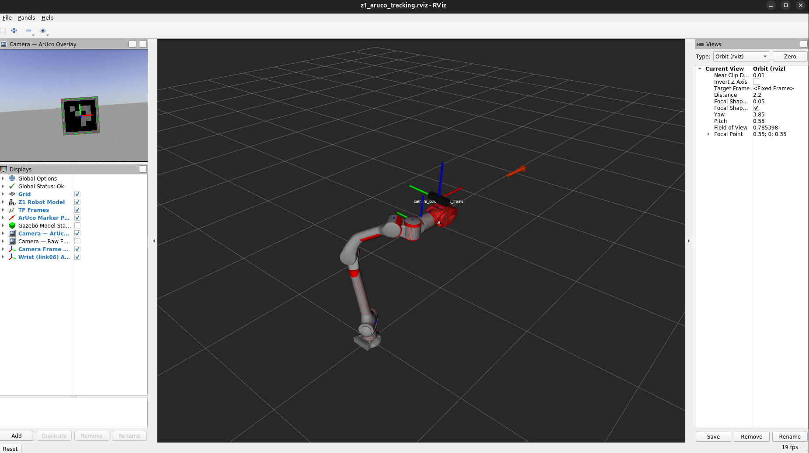
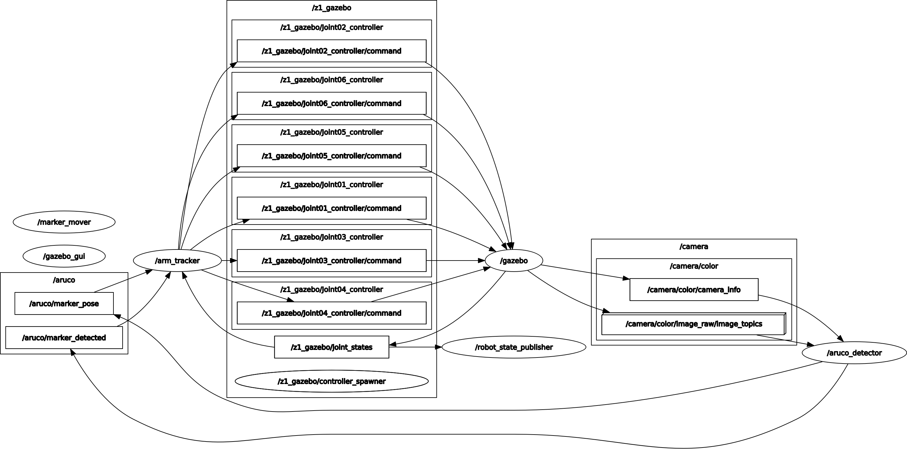

# ROS Noetic Z1 Arm Simulation

Gazebo simulation of the Unitree Z1 robotic arm with ArUco marker tracking, containerized in Docker.


---

## Table of Contents

- [Overview](#overview)
- [Key Features](#key-features)
- [Installation and Dependencies](#installation-and-dependencies)
- [Quick Start](#quick-start)
- [Project Structure](#project-structure)
- [Architecture](#architecture)
- [Configuration](#configuration)
- [Troubleshooting](#troubleshooting)
- [AI-Assistance](#ai-assistance)

---

## Overview

We run ROS Noetic inside Docker to simulate the Unitree Z1 arm on Ubuntu 24, which does not natively support Noetic. The workspace implements a full perception-to-control pipeline: a RealSense D435 camera in Gazebo detects a moving ArUco marker, and the Z1 arm follows it in real time using Cartesian control.

The primary use case is a robotics workshop where participants receive boilerplate ROS nodes with TODOs and must complete the vision and control pipelines.

The image uses Mesa software rendering (llvmpipe) by default — no GPU is required to run Gazebo or RViz.

---

## Key Features

- Full Gazebo simulation of the Unitree Z1 6-DOF arm with gripper
- ArUco marker detection via OpenCV and cv_bridge, published as 3D world-frame poses
- Configurable camera modes: end-effector (wrist-mounted) and fixed (static world pose)
- Animated marker with configurable motion patterns: sinusoidal, circular, figure-8, and static
- Smooth Cartesian arm tracking with low-pass filtering and workspace clamping
- Centralized YAML configuration — change marker motion, tracking gain, camera mode, and workspace limits without rebuilding
- Pre-configured RViz layout with robot model, TF tree, camera feeds, and marker pose visualization
- Software rendering baked in — works without NVIDIA drivers or GPU passthrough
- Live file sync via Docker bind mounts — edit source on the host, relaunch inside the container

---

## Installation and Dependencies

### Prerequisites

| Dependency | Version | Notes |
| --- | --- | --- |
| Docker | 24+ | Required |
| Python | 3.8 | Inside the container |
| ROS Noetic | 1.16 | Inside the container |
| X11 / `xhost` | any | Required for GUI (Gazebo, RViz) |

No ROS installation is needed on the host. Everything runs inside the container.

### Build the Docker Image [RECOMMENDED]

```bash
git clone <repo-url> ros_docker
cd ros_docker
docker build -t ros-z1-aruco-real .
```

The build installs ROS Noetic, Gazebo, RViz, OpenCV with ArUco support, the RealSense2
ROS driver, and compiles `z1_controller` and `sdk_z1` binaries. First build takes
10-15 minutes.

### Optional — GPU Hardware Rendering

The image uses software rendering by default. To override to NVIDIA GPU rendering,
install `nvidia-container-toolkit` on the host:

```bash
sudo apt-get install nvidia-container-toolkit
sudo nvidia-ctk runtime configure --runtime=docker
sudo systemctl restart docker
```

Then pass `-e LIBGL_ALWAYS_SOFTWARE=0 --gpus all` to `docker run`. See [docs/DOCKER_CMDS.md](docs/DOCKER_CMDS.md) for the full command.

---

## Quick Start

**1. Allow X11 forwarding on the host:**

```bash
xhost +local:docker
```

**2a. Gazebo simulation (simulated camera + animated marker):**

```bash
docker run -it --rm \
  --name ros-z1-real \
  -e DISPLAY=$DISPLAY \
  -v /tmp/.X11-unix:/tmp/.X11-unix \
  ros-z1-aruco-real bash
```

Inside the container:

```bash
z1_sim        # launches Gazebo + ArUco tracking simulation
z1_unpause    # unpause physics (separate terminal)
z1_rviz       # open RViz (separate terminal)
```

**2b. Real camera mode (physical D435 + Gazebo arm):** [RECOMMENDED for workshop]

Find the D435 USB bus on the host:

```bash
lsusb | grep RealSense
# example: Bus 004 Device 003: ID 8086:0b07 Intel Corp. RealSense D435
```

```bash
docker run -it --rm \
  --name ros-z1-real \
  -e DISPLAY=$DISPLAY \
  -v /tmp/.X11-unix:/tmp/.X11-unix \
  --device /dev/bus/usb/004:/dev/bus/usb/004 \
  ros-z1-aruco-real bash
```

Inside the container:

```bash
z1_real       # launches Gazebo arm + real D435 tracking
z1_unpause    # unpause physics (separate terminal)
z1_rviz       # open RViz (separate terminal)
```

**3. Open RViz (any mode, Terminal 2):**

```bash
docker exec -e DISPLAY=$DISPLAY -it ros-z1-real bash -c \
  "source ~/.bashrc && z1_rviz"
```

See [docs/STARTUP.md](docs/STARTUP.md) for the full developer reference — roslaunch arguments,
configuration, architecture notes, troubleshooting, and future work.

---

## Project Structure

```txt
ros_docker/
├── Dockerfile                        # ROS Noetic image with all dependencies
├── README.md
├── docs/
│   ├── STARTUP.md                    # Full developer reference — build, run, config, architecture
│   ├── DOCKER_CMDS.md                # Docker command reference
│   ├── QUICKSTART.md                 # (legacy — superseded by STARTUP.md)
│   ├── CONTROL_GUIDE.md              # (legacy — content merged into STARTUP.md)
│   └── GAZEBO_SIM_GUIDE.md           # (legacy — content merged into STARTUP.md)
│
├── z1_aruco_detector/                # ROS package — perception pipeline
│   ├── src/
│   │   ├── aruco_detector_node.py    # Detects ArUco, publishes 3D marker pose
│   │   └── marker_mover_node.py      # Animates the ArUco marker in Gazebo
│   └── config/
│       └── aruco_tracking.yaml       # Centralized simulation configuration
│
├── z1_arm_tracker/                   # ROS package — control pipeline
│   └── src/
│       └── arm_tracker_node.py       # Sends Cartesian commands to sim_ctrl via UDP
│
├── z1_aruco/                         # ROS package — project-specific launch, worlds, models
│   ├── launch/
│   │   ├── z1_aruco_tracking.launch        # Simulation: Gazebo + simulated camera + marker
│   │   └── z1_real_camera_tracking.launch  # Real camera: Gazebo arm + physical D435
│   ├── worlds/
│   │   ├── aruco_tracking.world       # World with arm and ArUco marker
│   │   └── aruco_tracking_real.world  # World with arm only (no marker, no camera)
│   ├── models/
│   │   ├── realsense_d435/            # Gazebo RealSense D435 model
│   │   └── aruco_marker_0/            # Gazebo ArUco marker ID 0 model
│   ├── xacro/
│   │   └── z1_aruco_robot.xacro      # Z1 URDF with end-effector camera additions
│   └── rviz/
│       └── z1_aruco_tracking.rviz     # Pre-configured RViz layout
│
├── unitree_ros/                      # Unitree ROS packages (submodule, unmodified upstream)
│
├── z1_controller/                    # Unitree Z1 FSM controller (C++)
│   └── build/                        # sim_ctrl binary (run from here)
│
├── sdk_z1/                           # Unitree Z1 SDK (C++)
│   └── build/                        # highcmd_basic, lowcmd_development, etc.
│
└── tests/                            # Development test scripts
    ├── test_arm_motion.py
    ├── test_follower_no_camera.py
    └── test_marker_control.py
```

---

## Architecture

Two modes share the same detector and tracker — only the image source changes.

**Simulation mode** (`z1_aruco_tracking.launch`):

```txt
  Gazebo Simulation
  ┌──────────────────────────────────────────────────┐
  │  Z1 Arm  ←── joint controllers                   │
  │  ArUco Marker (animated by marker_mover_node)    │
  │  RealSense D435 camera plugin (URDF, wrist)      │
  └──────────────┬───────────────────────────────────┘
                 │ /camera/color/image_raw
                 ▼
        aruco_detector_node ──► arm_tracker_node
                                       │ MotorCmd
                                       ▼
                               joint controllers
```

**Real camera mode** (`z1_real_camera_tracking.launch`):

```txt
  Physical D435 (USB)          Gazebo Simulation
  ┌─────────────────┐          ┌──────────────────────┐
  │  RealSense D435 │          │  Z1 Arm              │
  │  (real frames)  │          │  (camera TF on wrist)│
  └────────┬────────┘          └──────────────────────┘
           │ /camera/color/image_raw
           ▼
  aruco_detector_node ──► arm_tracker_node
                                 │ MotorCmd
                                 ▼
                         joint controllers
```

### Data Flow

| Topic | Type | From | To |
| --- | --- | --- | --- |
| `/camera/color/image_raw` | `sensor_msgs/Image` | Gazebo plugin or real D435 | aruco_detector |
| `/aruco/marker_pose` | `geometry_msgs/PoseStamped` | aruco_detector | arm_tracker |
| `/aruco/marker_detected` | `std_msgs/Bool` | aruco_detector | arm_tracker |
| `/aruco/debug_image` | `sensor_msgs/Image` | aruco_detector | image_view / RViz |
| `/z1_gazebo/JointXX_controller/command` | `MotorCmd` | arm_tracker | Gazebo joint controllers |
| `/gazebo/set_model_state` | `gazebo_msgs/ModelState` | marker_mover | Gazebo (sim mode only) |

---

## Configuration

All simulation parameters load from a single file at launch time:

```txt
z1_aruco_detector/config/aruco_tracking.yaml
```

Edit this file on the host and relaunch — no rebuild required when using bind mounts.

### Camera Mode

```yaml
camera:
  mode: end_effector   # end_effector (wrist-mounted) or fixed (static world pose)
```

The launch file argument `camera_mode:=end_effector` must match `camera/mode` in the YAML.

### Marker Motion

```yaml
marker:
  motion_pattern: square   # sinusoidal, circular, figure8, square, static
  center: [0.70, 0.0, 0.50]
  amplitude_y: 0.20
  amplitude_z: 0.10
  frequency: 0.2           # Hz
```

### Marker Detection

```yaml
aruco:
  marker_size: 0.05          # physical marker size in metres (border included) — must be exact
  dictionary: DICT_4X4_50
  tracking_id: 0

  # Detection tuning — important for small or distant markers
  min_marker_perimeter_rate: 0.02   # lower = detect smaller/more distant markers (default 0.03)
  error_correction_rate: 0.6        # raise to 0.8 if marker is blurry or poorly printed
```

**`marker_size` must match everywhere:** the YAML value, the Gazebo `model.sdf` box
dimensions (`z1_aruco/models/aruco_marker_0/model.sdf`), and the physical printed marker
must all use the same size. A mismatch compresses all pose estimates by the ratio
`yaml_size / actual_size` — the arm target will be wrong and tracking will fail.

For small markers (≤ 50 mm) the default OpenCV `minMarkerPerimeterRate` of 0.03 can cause
missed detections at distances above ~0.8 m. Set it to 0.02 or lower. See
[docs/STARTUP.md](docs/STARTUP.md) for a detection-range reference table.

### Arm Tracker

```yaml
arm_tracker:
  smoothing_alpha: 0.10    # low-pass filter (0.0=frozen, 1.0=instant snap)
  fixed_x: 0.25            # fixed forward reach (metres) — arm only follows Y and Z
  joint_kp: 150.0          # PD position gain for MotorCmd
  joint_kd: 3.0            # PD velocity gain for MotorCmd
  workspace:
    y: [-0.35, 0.35]
    z: [0.10, 0.75]
```

### roslaunch Arguments

```bash
# Simulation mode
roslaunch z1_aruco z1_aruco_tracking.launch \
  camera_mode:=end_effector \   # end_effector | fixed
  paused:=true \
  gui:=true \
  headless:=false \
  UnitreeGripperYN:=true

# Real camera mode
roslaunch z1_aruco z1_real_camera_tracking.launch \
  realsense_serial:="" \        # leave empty for first connected D435
  paused:=true \
  gui:=true \
  headless:=false \
  UnitreeGripperYN:=true
```

---

## Troubleshooting

```txt
Error: "cannot open display"
- Cause: X11 forwarding not enabled on the host
- Solution: Run "xhost +local:docker" before starting the container

Error: arm_tracker logs DRY RUN — not sending commands
- Cause: unitree_arm_interface Python binding failed to import (missing LD_LIBRARY_PATH)
- Solution: Rebuild the image — ENV LD_LIBRARY_PATH is set in the Dockerfile

Error: aruco_detector node starts but /aruco/marker_detected stays false
- Cause: Camera not publishing, or marker not visible in camera frame
- Solution: Check "rostopic hz /camera/color/image_raw" — should be ~30 Hz

Error: Gazebo opens but arm is frozen
- Cause: Gazebo starts paused by default
- Solution: Run z1_unpause or click Play in the Gazebo GUI

Error: D435 not found — RS2_USB_STATUS_ACCESS (real camera mode)
- Cause: udev rules not installed on host, or wrong USB bus passed to docker run
- Solution: Install udev rules (see docs/STARTUP.md section 4.1), unplug/replug D435,
            check bus with "lsusb | grep RealSense" and update --device path

Error: TF transform failed — extrapolation into the future (real camera mode)
- Cause: use_sim_time mismatch between Gazebo sim clock and D435 wall-clock timestamps
- Solution: Use z1_real_camera_tracking.launch — it sets use_sim_time:=false
```

---

## Gallery

### RViz — arm tracking marker in real time



### ROS node graph



### Gazebo simulation (video)

[z1-aruco-gazebo.webm](assets/z1-aruco-gazebo.webm)

### RViz visualization (video)

[z1-aruco-rviz.webm](assets/z1-aruco-rviz.webm)

### Real camera tracking — D435 + Gazebo arm (video)

[z1-aruco-realsense.webm](assets/z1-aruco-realsense.webm)

---

## AI-Assistance

Parts of this workspace were developed with the assistance of large language models
(Claude by Anthropic).

AI-generated code in this workspace controls a simulated robotic arm. Before using
any part of this code with real hardware:

- Review all motion limits and workspace bounds in `aruco_tracking.yaml`
- Validate Cartesian speed limits (`cartesian_speed`) against your physical setup
- Test incrementally at low speeds before enabling full tracking
- This code is provided for simulation and educational use — use caution when
  adapting it for real hardware applications
